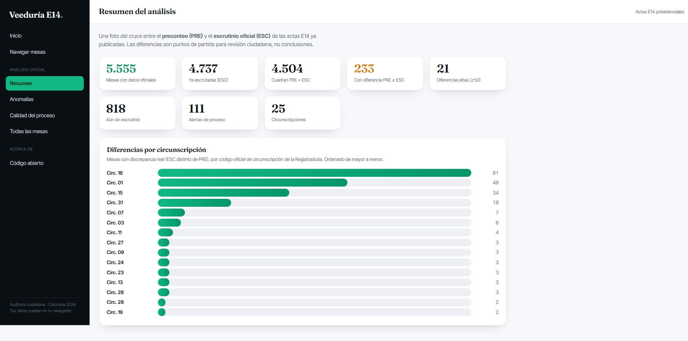
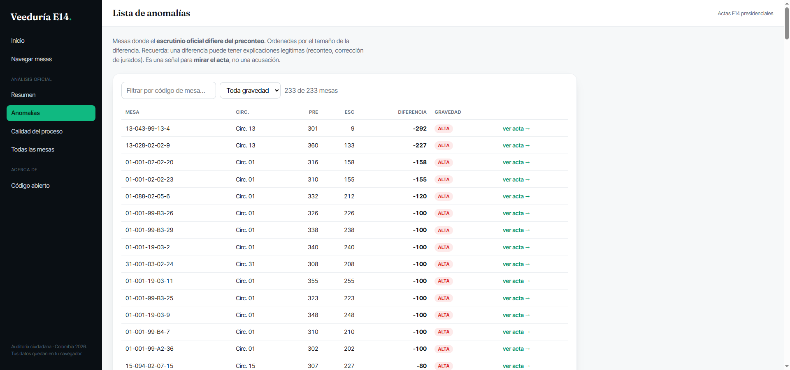
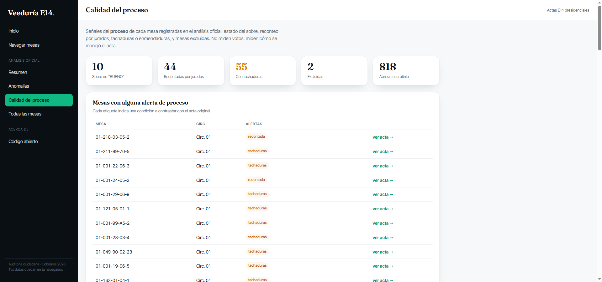
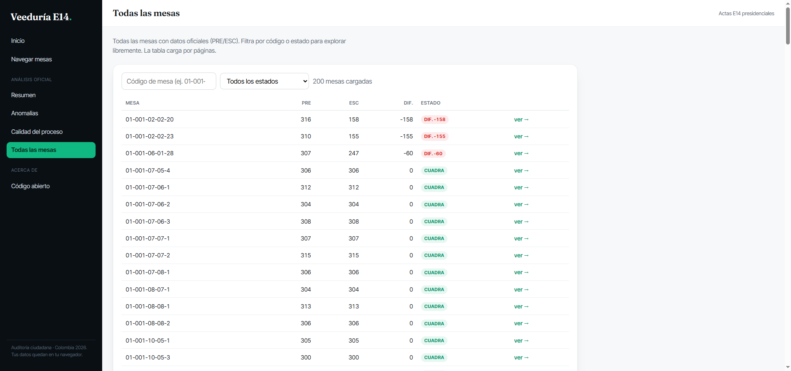
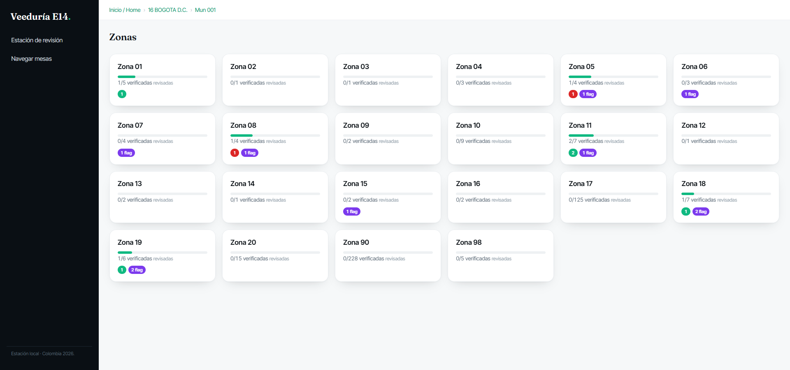
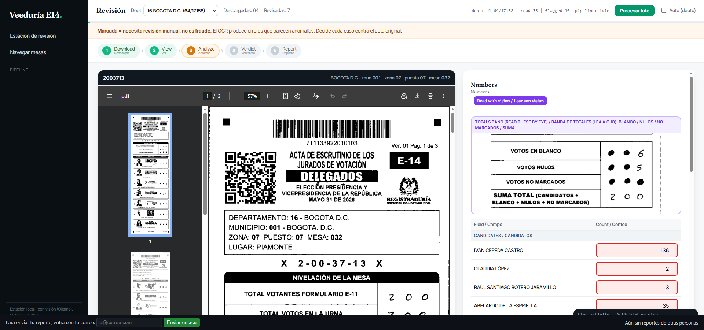

# colombia-veeduria-e14-2026

[🇪🇸 Español](README.md) · **🇬🇧 English**

[](LICENSE)


**Audit tool for Colombia's E14 presidential tally sheets (2026 election).**

It downloads the scanned E14 tally sheets that Colombia's **Registraduría**
publishes on its public results site
(`divulgacione14presidente.registraduria.gov.co`), reads the handwritten vote
counts with a **local** vision model, checks that the reported sums add up, and
lets a human review every flagged form against the original PDF. The goal is to
make auditing the published results **transparent and reproducible** — entirely
on your own machine, nothing uploaded.

> **A flag means "needs manual review", not "fraud".** Vision and OCR misread
> handwriting, so mismatches are often reading errors. Every finding links back
> to the original PDF for a human to verify. See the note at the end.

**Quick start:** install the tools (see [INSTALL_OCR.md](INSTALL_OCR.md)), then
follow [Pipeline flow](#pipeline-flow). To review forms in a browser, jump to
[Review station](#review-station-human-in-the-loop).

## Screenshots

**Official-data dashboard** — cross-checks the pre-count (PRE) against the
official scrutiny (ESC) of already-published tally sheets and surfaces what
deserves review. Metrics and chart are computed live over the loaded tables:



**Anomalies list** — tables where the scrutiny differs from the pre-count,
severity-graded and filterable. A difference is a signal to look at the sheet,
not an accusation:



**Process quality** and a **filterable table of every polling table** complete
the dashboard (envelope/recount/erasure/exclusion flags and paginated browsing):




**Hierarchical browser** — browse like the official site: Department →
Municipality → Zone → Station → tables, with per-level progress (`X/Y verified`)
and verdict chips:



**Review station** — open a table to verify it: the PDF on the left, the numbers
(auto-read by the local vision model, confirmed by you) on the right, including a
zoomed crop of the blank/null/unmarked/total band:



The first supported source is the **E14 tally form** published by Colombia's
Registraduría on its public results website. The architecture is
source-agnostic: any jurisdiction that publishes scanned tally sheets can be
added as a new source.

Everything runs locally. A SQLite database (`data/pipeline.db`) is the single
source of truth, the PDFs live in `data/forms`, and reports are written to
`data/reports/`. Nothing is uploaded.

## Source site layout (empirically confirmed)

- **Metadata**: static JSON files served from `/assets/temis/divipol_json/`. The
  master file is `allTransmissionCodes.json` (~36 MB): one node per polling table
  with its `expectedName` (the PDF file name) and location coordinates.
- **Tally sheet PDF**, URL pattern **confirmed 12/12** by observing live traffic:

  ```
  /assets/temis/pdf/{dept}/{mun}/{zone:3digits}/{stationCode}/{tableNumber}/PRE/{expectedName}
  ```

  Key detail: the **zone is zero-padded to 3 digits** (`09` -> `009`);
  `stationCode` and `tableNumber` are used as-is. The polling station is
  `stationCode` and the polling table is `tableNumber`.
- **Anti-bot protection**: the source site sits behind a CDN/WAF. A real browser
  always passes; a plain Python client may need browser cookies (see step 2.5).
- **Universe**: ~121,592 polling tables (status `11` = published; `3` = a special
  subset).

## Pipeline flow

The pipeline runs in three stages, all locally against the SQLite database. The
agent orchestrates them in a resumable loop; you can also run each stage on its
own.

```bash
# 1. Prepare the metadata and load the index into SQLite
python inspect_meta.py          # download metadata JSON
python discover.py              # build data/index.csv (one row per polling table)
python import_index.py          # load the index into data/pipeline.db
python check_access.py          # does plain Python pass the WAF? tells you which path to use

# 2. Run the whole pipeline for a department (resumable loop)
python agent.py --dept 16       # download -> ocr -> validate, looping until done

# ...or run the stages individually:
python download.py --status 11              # Stage 1: resumable download
python download.py --status 11 --dept 16    # or filter by department
python ocr.py --status 11                   # Stage 2: OCR the downloaded PDFs
python validate.py --dept 16                # Stage 3: vote-sum check, flag mismatches

# If the WAF blocks plain Python, use the browser download path:
pip install --user playwright && python -m playwright install chromium
python browser_download.py --status 11

# 3. Check progress and generate the local report
python status.py                # report pipeline progress per stage
python verify_mapping.py        # sanity-check index -> URL -> local path mapping
python report.py --dept 16      # writes data/reports/summary.html (open it in a browser)
```

Always start with `--limit 20` to validate before downloading everything.

Downloaded PDFs are written to `data/forms`. The local report is written to
`data/reports/summary.html` (bilingual EN/ES).

## Stages

| Stage | Name | What it does |
|---|---|---|
| 1 | Download | Fetch tally sheet PDFs; resumable; validates `%PDF` magic bytes |
| 2 | Read (OCR / vision) | Read the handwritten numbers off each PDF and store them |
| 3 | Validation | Check that the reported vote sums add up; flag mismatches |

## Review station (human-in-the-loop)

A flag is never the final word — a human confirms each one against the original
PDF. The review station is a local web app for exactly that:

```bash
python review_server.py --dept 16     # serves http://127.0.0.1:8765
```

- **Browse like the official site**: Department → Municipality → Zone → Station →
  tables. Each card shows your progress (`X/Y verified`) and per-verdict chips.
- **Open any table**: its PDF is downloaded on demand if missing, and the local
  vision model auto-reads the numbers to pre-fill the form (a guess you confirm).
- **Verdict**: mark each table Verified / Anomaly / Unclear. Verdicts are stored
  in the local `reviews` table; nothing leaves the machine.
- **Official-data dashboard**: when Supabase is configured, the sidebar shows an
  "Análisis oficial" section (Summary, Anomalies, Process quality, All tables) —
  the same four views as the public app, to prioritize which tables to review
  first. They live in `dashboard_views.py`, shared by both apps.

### Reading handwriting (local vision)

Tesseract reads the printed labels but not the handwritten counts. For those,
`vision.py` calls a **local** vision model via Ollama (`qwen2.5vl`), entirely
on-machine. The blank/null/unmarked band is read from a tight, label-included
crop (`crop_totals.py`) — full-page reads return 0 for that band. Every number
is a guess the reviewer confirms against the PDF; vision misreads handwriting,
so its output is a starting point, not a verdict.

## Files

| File | What it does |
|---|---|
| `config.py` | URLs, headers, and `pdf_url(node)` implementing the confirmed pattern |
| `db.py` | SQLite schema and helpers (`polling_tables`, `findings`) for `data/pipeline.db` |
| `inspect_meta.py` | Downloads and inspects the metadata JSON files |
| `discover.py` | Generates `data/index.csv` (polling table -> tally URL -> local path) |
| `import_index.py` | Loads `data/index.csv` into the SQLite database |
| `verify_mapping.py` | Sanity-checks the index -> URL -> local path mapping |
| `check_access.py` | Diagnoses whether plain Python passes the WAF; supports `cookies.txt` |
| `download.py` | Stage 1 downloader: resumable, concurrent, validates `%PDF` |
| `ocr.py` | Stage 2 OCR runner over downloaded PDFs |
| `validate.py` | Stage 3 vote-sum check; flags mismatches for manual review |
| `agent.py` | Orchestrates Stages 1–3 in a resumable loop |
| `status.py` | Reports pipeline progress per stage from the database |
| `report.py` | Generates the local report at `data/reports/summary.html` |
| `browser_download.py` | Fallback download path using Playwright (a real browser) |
| `vision.py` | Local vision reader (Ollama) for handwritten numbers + totals band |
| `crop_totals.py` | Crops the labelled blank/null/unmarked/total band for vision |
| `candidates.py` | Fixed master list of candidates + fuzzy name matching |
| `runner.py` | In-process pipeline runner used by the review station |
| `review_server.py` | Local web app: hierarchical browser + review station + official-data dashboard |
| `public_server.py` | Public web app: browser + manual entry + consensus (Supabase) + official-data dashboard |
| `dashboard_views.py` | The four dashboard views (summary, anomalies, quality, table), shared by both apps |
| `consolidate.py` | Aggregates confirmed results across reviewed tables |

## Design principles

- **Local-only**: the database, the PDFs, and the reports stay on your machine.
  Nothing is uploaded; the only outbound traffic is fetching the public PDFs.
- **Resumable**: skips PDFs that are already downloaded and valid (`%PDF` magic
  bytes); the per-stage SQLite status lets you stop and restart at any time.
- **Respectful**: limited concurrency and pauses. This is public election
  infrastructure; the pipeline must never overload it.
- **Auditable**: `data/index.csv` links every PDF to its
  department/municipality/zone/station/table, its transmission code, status, and
  the original source URL.
- **Robust**: the server returns `200 + text/html` (the SPA shell) for
  nonexistent routes, so files are validated by **magic bytes**, never by HTTP
  status code.

## Important: flagged forms need manual review, not "fraud confirmed"

A flagged tally sheet means **"needs manual review"** — it is **not** proof of
fraud. OCR and digitization produce errors that look like anomalies; many
mismatches come from the OCR step, not from the tally sheets themselves. Every
finding links back to the original PDF so a human can verify it directly. This
discipline is what makes the work credible rather than dismissible.
